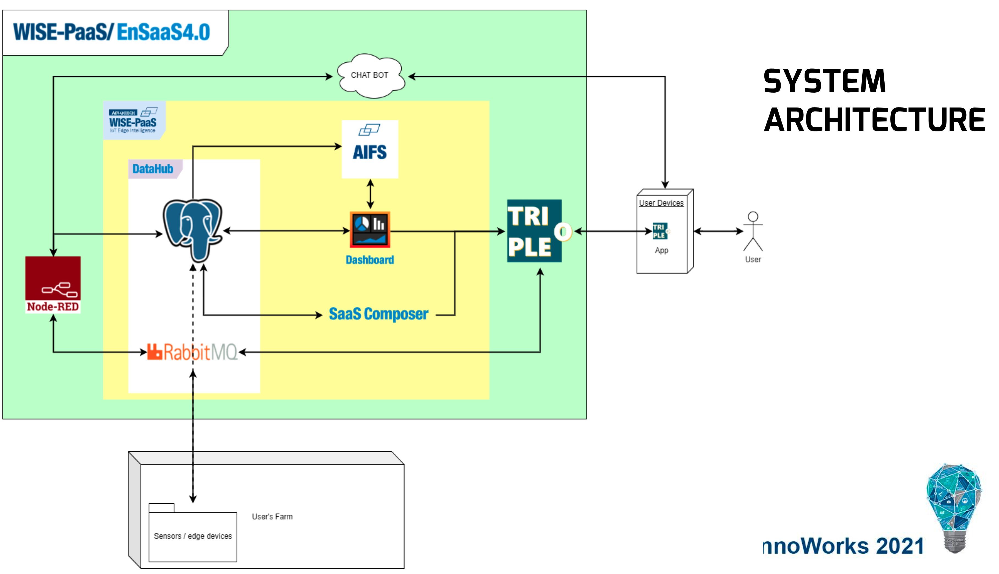
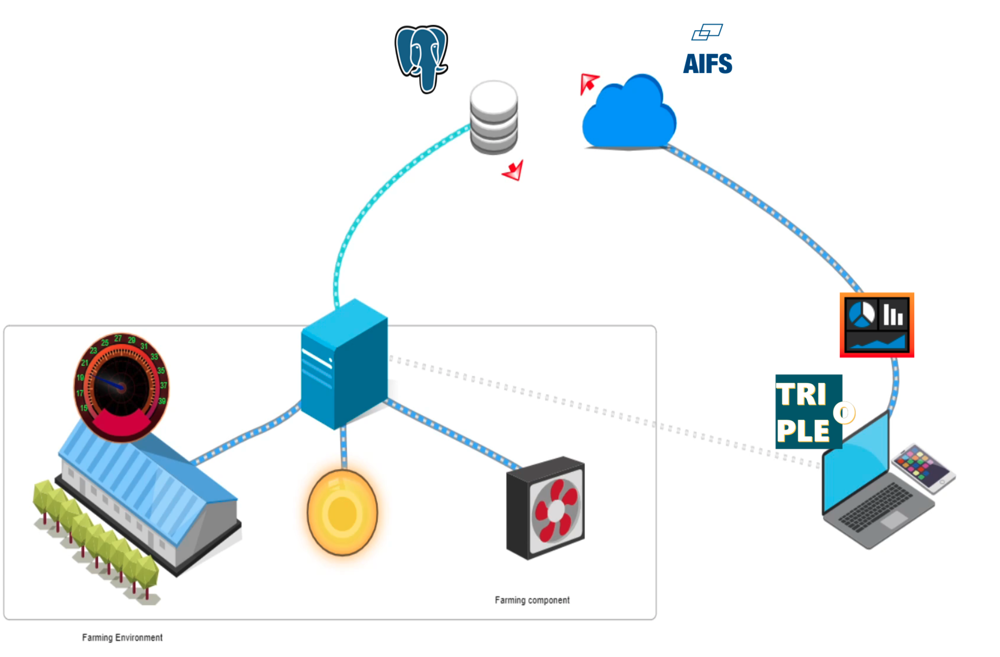
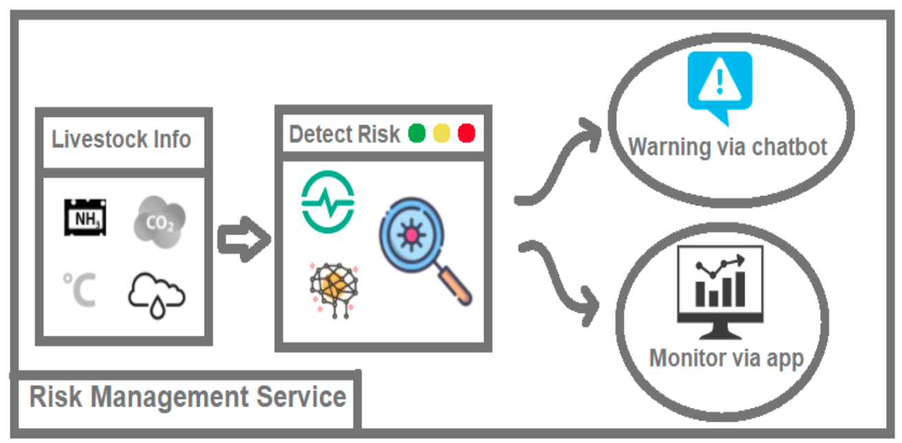
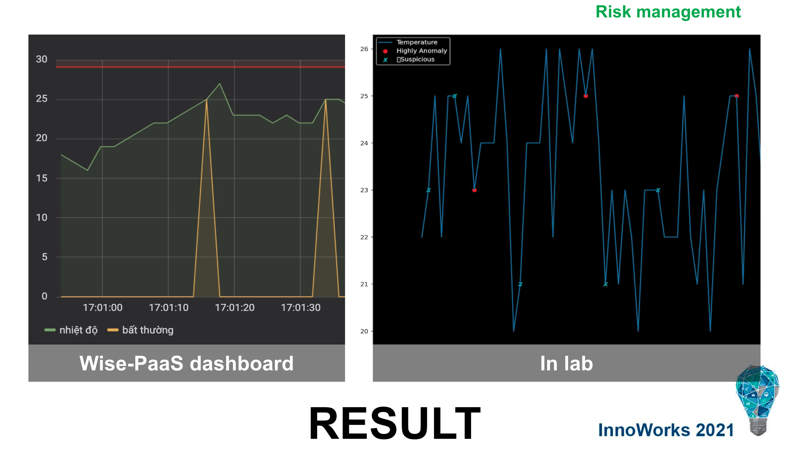
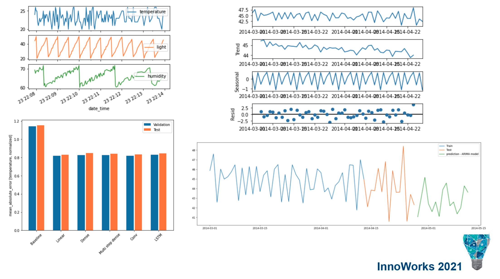
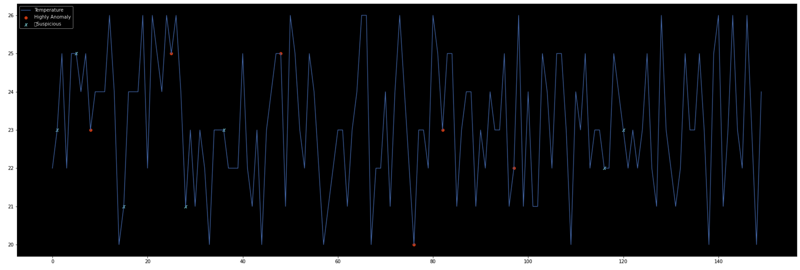
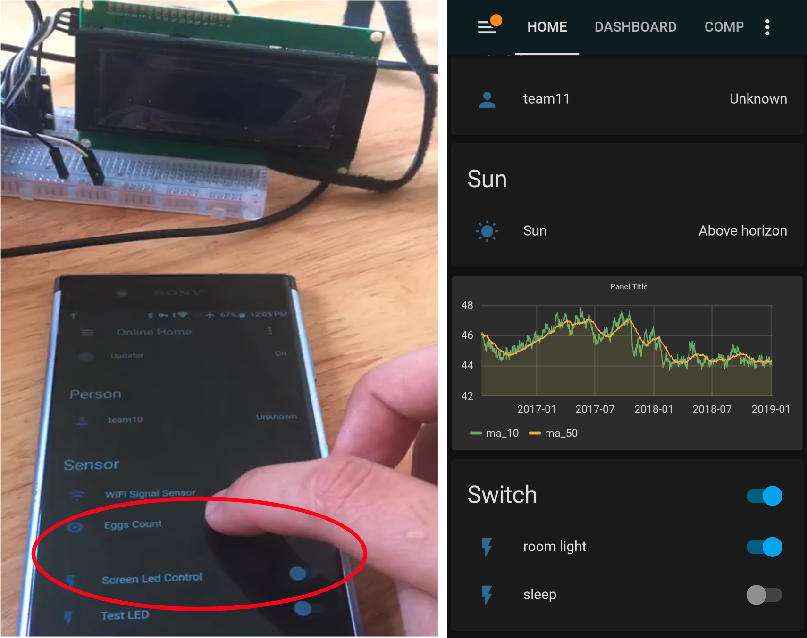
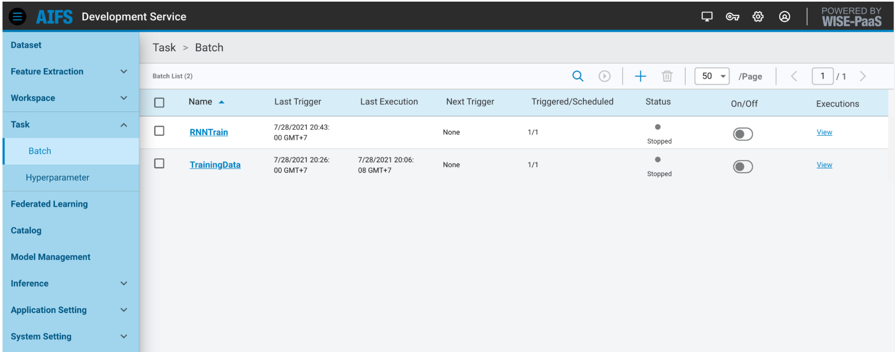

# Anomaly Detection in Smart Farming Systems

| Table of Content |
| --- |
| I/ [Introduction](#introduction) |
| II/ [Project Background](#project-background) |
| III/ [Key Features](#key-features) |
| IV/ [System Architecture](#system-architecture) |
| V/ [Demo](#demo) |
_____

## I/ Introduction

This project presents a Smart Farming anomaly detection system crafted as part of journey at AIoT competition. I and my team had secured the 2nd prize during my freshman year. 

## II/ Project Background

In terms of Smart Farming, data-driven decisions are paramount. Anomaly detection stands at the forefront of this revolution, identifying outliers that signal potential issues in crop health, livestock management, or environmental conditions. I have developed a solution that leverages state-of-the-art deep learning VAE-LSTM and 3 statistic methods to analyze time-series sensor data, ensuring early detection of anomalies that could indicate critical changes within a farming ecosystem.

## III/ Key Features

1. **Hybrid VAE-LSTM Model:** 
   - Harnessing VAE for its generative features to reconstruct sensor data, paired with LSTM's sequential pattern learning to distinguish anomalies effectively.

2. **Dynamic Thresholding:**
   - Implementing adaptive thresholding to categorize a data point as normal or anomalous by considering various methods: standard mean deviation, cumulative density function, and z-score to find out the best result.

3. **Data Preprocessing Pipeline:**
   - Engineered to transform raw data into a suitable format, emphasizing sequence generation and feature normalization for neural network consumption.

4. **Real-Time Anomaly Alerting:**
   - Integrating the model with a real-time monitoring setup that promptly flags and alerts upon detection of an anomaly.

5. **Interactive Dashboard:**
   - Ultilize visualization platform - Grafana for users to observe data trends, anomaly detection, and alerts through an intuitive interface.

## IV/ System Architecture

This section will outline the high-level design of the Smart Farming system, including how data flows from sensors to the dashboard. 

## V/ Demo

* Lab vs Practice:

Legend: Normal temperature, Highly Anomaly, or Suspicious

* Lab:

* Practice:

